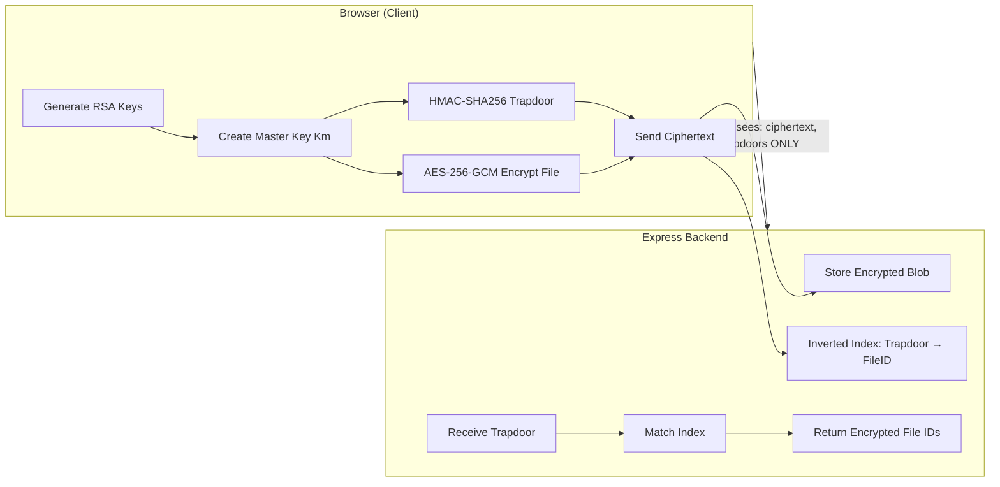

# Zero-Knowledge Vault — Walkthrough

## What Was Built

A full-stack hackathon prototype for **Zero-Knowledge Vault** — encrypted cloud storage with searchable encryption (SSE). Based on the Hackathon PPT by Kartikey Tyagi & Rishank Semalti.

## Architecture



> [!IMPORTANT]
> The server **never** sees plaintext data, original filenames, search keywords, or the master encryption key. All crypto happens client-side.

## File Structure

```
zk-vault/
├── backend/
│   ├── package.json
│   ├── server.js                 # Express entry point (port 3001)
│   ├── lib/
│   │   ├── crypto.js             # RSA-OAEP, AES-256-GCM, HMAC-SHA256
│   │   └── storage.js            # In-memory encrypted file store + inverted index
│   └── routes/
│       ├── auth.js               # POST /api/keys/generate
│       ├── files.js              # CRUD for encrypted files
│       └── search.js             # Trapdoor-based search
├── src/
│   ├── api.js                    # Client-side Web Crypto + API calls
│   ├── App.jsx                   # Main UI with live vault
│   ├── App.css                   # Component styles
│   ├── index.css                 # Design system
│   └── main.jsx                  # Vite entry
└── package.json
```

## API Endpoints

| Method | Endpoint | Purpose |
|--------|----------|---------|
| `POST` | `/api/keys/generate` | Generate RSA pair + Km, wrap key, create session |
| `GET` | `/api/keys/session/:id` | Verify session exists |
| `POST` | `/api/files/upload-json` | Store encrypted file + trapdoors |
| `GET` | `/api/files` | List encrypted file metadata |
| `GET` | `/api/files/:id` | Download encrypted file blob |
| `DELETE` | `/api/files/:id` | Delete file + cleanup index |
| `POST` | `/api/search` | Single trapdoor search |
| `POST` | `/api/search/multi` | Multi-trapdoor Boolean AND search |
| `GET` | `/api/health` | Health check + vault stats |

## Cryptographic Flow

1. **Key Init**: `RSA-2048` key pair → Master Key `Km` (256-bit) → `Km_wrapped = RSA-OAEP(Km, pubKey)`
2. **Upload**: File → `AES-256-GCM(file, Km)` → Keywords extracted → `Trapdoor = HMAC-SHA256(Km, keyword)` → Server stores ciphertext + trapdoors
3. **Search**: Keyword → `HMAC-SHA256(Km, keyword)` → Server matches trapdoor in inverted index → Returns encrypted file IDs
4. **Download**: Server sends ciphertext → Client decrypts with `AES-256-GCM(ciphertext, Km)`

## How to Run

```bash
# Terminal 1 — Backend
cd zk-vault/backend
npm install
node server.js          # → http://localhost:3001

# Terminal 2 — Frontend
cd zk-vault
npm install
npm run dev             # → http://localhost:5173
```

## Verified

- ✅ Backend starts on port 3001 with health endpoint
- ✅ Frontend connects to backend (green indicator in navbar)
- ✅ "Initialize Vault" generates RSA keys + Km + session
- ✅ Crypto operation log shows full key generation flow
- ✅ "Upload & Encrypt" button enabled after initialization
- ✅ Vault section shows search bar + file list
- ✅ All sections from PPT represented: Features, Workflow, Tech Stack, Impact

## Screenshots

````carousel

<!-- slide -->

````
