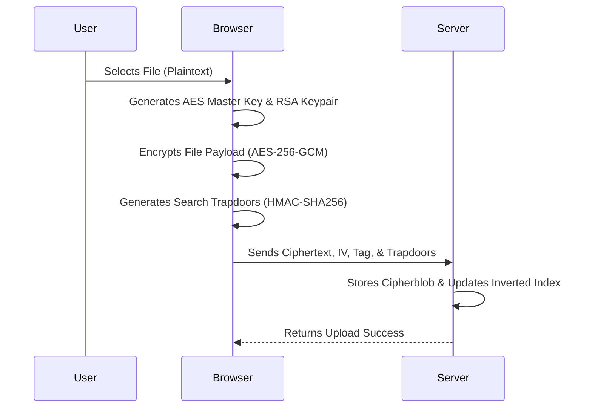

# Zero-Knowledge Vault: Hackathon Presentation Outline

## 1. Problem Statement
- **The Cloud Trust Deficit:** Traditional cloud storage providers have absolute access to user data. Even if data is encrypted at rest, the server holds the encryption keys natively.
- **Vulnerability to Breaches:** Centralized servers represent single points of failure. When compromised, millions of records (medical data, financial records, PII) are exposed to malicious actors in plaintext.
- **Privacy Erosion:** Third-party scanning, indexing, and mining of user files for advertising or unauthorized surveillance fundamentally violate user privacy rights.

## 2. Our Solution: Zero-Knowledge Vault
- **A Trustless Architecture:** We built a highly secure, privacy-first storage system where the server *never* has access to plaintext files, encryption keys, or search intents. 
- **Client-Side Supremacy:** All computationally intensive cryptographic operations (encryption, decryption, key generation) happen completely within the user's local browser memory.
- **State-of-the-Art Encrypted Search:** Users can instantaneously search and filter their encrypted files without revealing the targeted keyword to the server or decrypting the underlying database.

## 3. Tech Stack
*(Referencing our established Zero-Knowledge tech stack architecture)*
- **Frontend Layer:** React 19, Vite, Vanilla CSS (Custom cybersecurity-themed aesthetics prioritizing dark mode and glassmorphism).
- **Backend Infrastructure:** Node.js (ESM), Express.js framework, Multer (Strict in-memory buffer processing without disk caching).
- **Cryptographic Engine (Node.js Native `crypto`):**
  - *Asymmetric Key Exchange:* RSA-OAEP (2048-bit)
  - *Symmetric Data Encryption:* AES-256-GCM (Authenticated Encryption with Associated Data)
  - *Searchable Symmetric Encryption (SSE):* HMAC-SHA256 for deterministic, collision-resistant trapdoor generation.

## 4. Work Flow
Below is the architectural flow of how our protocol mathematically guarantees Zero-Knowledge during operation.

### File Upload & Encryption Flow

### Encrypted Search & Decryption Flow

```mermaid
sequenceDiagram
    participant User
    participant Browser
    participant Server
    User->>Browser: Enters Search Keyword
    Browser->>Browser: Derives Search Trapdoor (HMAC-SHA256)
    Browser->>Server: Sends Trapdoor (No Plaintext)
    Server->>Server: Blindly Matches Trapdoor in Inverted Index
    Server-->>Browser: Returns Matched Ciphertexts
    Browser->>Browser: Authenticates & Decrypts Data (AES-256-GCM)
    Browser-->>User: Displays Plaintext File
```

## 5. Key Features
- **True Zero-Knowledge Guarantee:** The backend functions merely as a fast inverted-index graph and raw cipher-blob storage bucket. It knows nothing.
- **Tamper-Proof Authenticated Encryption:** By utilizing AES-GCM, any corruption, tampering, or bit-flipping on the server side is immediately flagged and rejected by the client-side decryption engine.
- **Blind Search Engine Engine:** Our Searchable Symmetric Encryption (SSE) mechanism allows exact-match data retrieval over deeply encrypted datasets with zero data leakage.
- **Ephemeral Cryptographic Sessions:** Sensitive materials (like the RSA private key) exist purely in volatile local memory and are completely wiped upon session termination.

## 6. Impacts
- **Absolute Data Sovereignty:** Cryptographically enforces the principle that *only* the verified data owner can read their own information.
- **Absolute Breach Immunity:** Even if the entire backend infrastructure and database are compromised by a state-actor, the attackers acquire mathematically useless ciphertext blobs. No keys, no data.
- **Regulatory Compliance by Default:** Inherently supports and bypasses strict privacy frameworks (GDPR, HIPAA, CCPA) by fundamentally removing the liability of holding readable PII (Personally Identifiable Information).

## 7. Future Plans
- **Secure Distributed File Sharing:** Implementing a Proxy Re-Encryption (PRE) protocol to allow users to securely share specific files without exposing their master key.
- **Multi-Device Synchronization:** Enabling secure cross-device key sharing utilizing decentralized identity (DID) mechanisms or WebAuthn.
- **Advanced Query Capabilities:** Expanding our SSE capabilities to securely support partial matches, range queries, and encrypted document sorting.
- **Mobile Native Applications:** Porting the core cryptographic engine computationally to React Native libraries for fully integrated iOS / Android applications.
